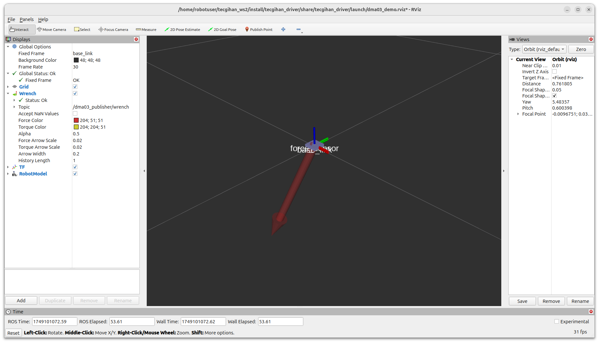
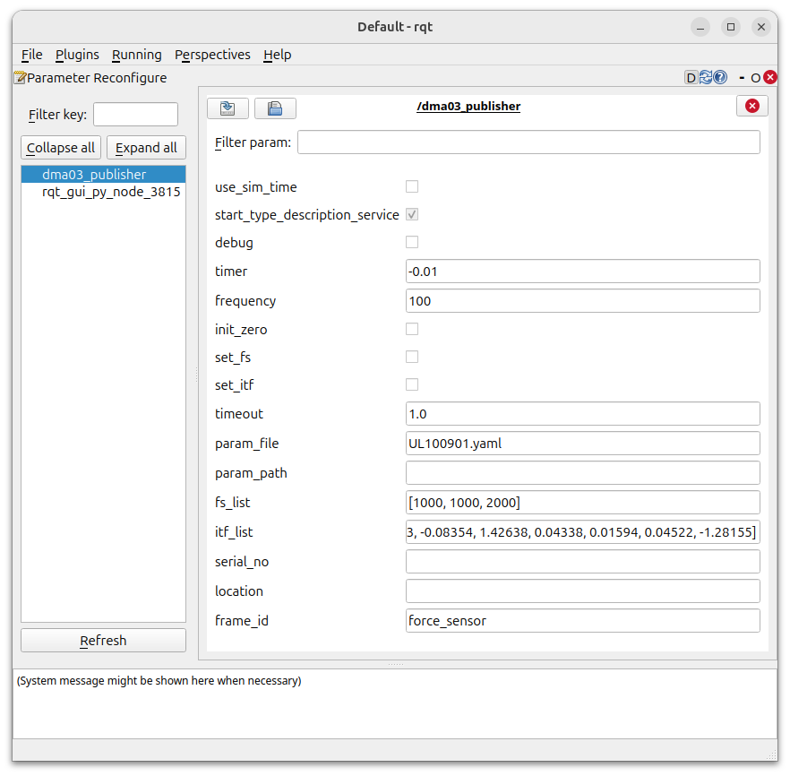
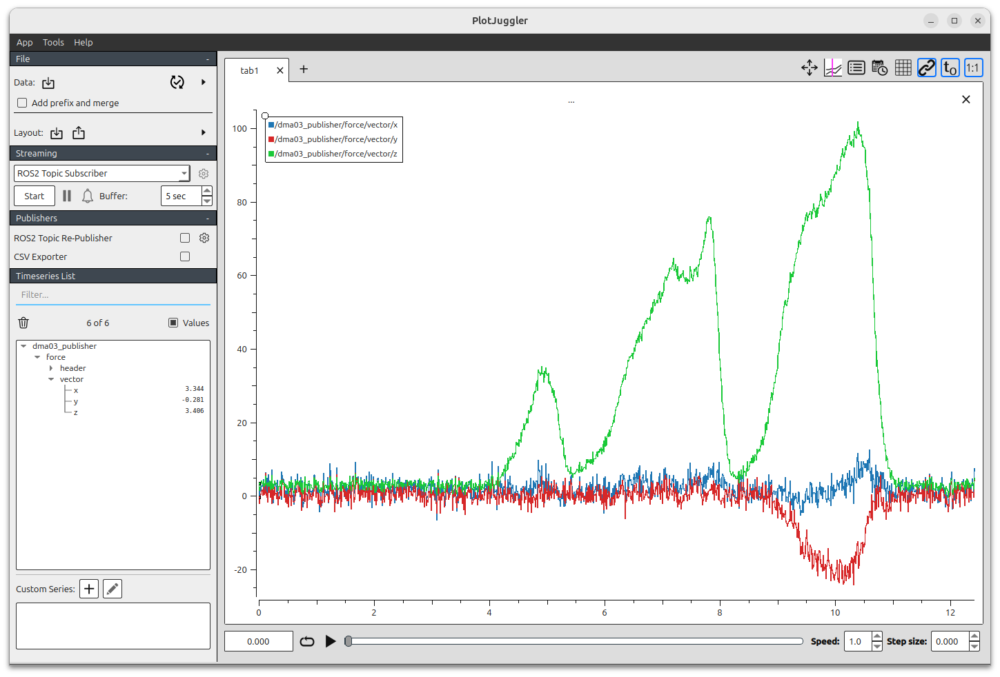

# tecgihan_driver

## Package Description - パッケージ概要

This package contains softwares for Tec Gihan Co.,Ltd. sensor amplifiers running with Linux and ROS (Robot Operating System).  

本パッケージはテック技販製センサアンプの Linux および ROS(Robot Operating System) 用ソフトウェアパッケージです．


## Sensors and Amplifiers - 対応センサ・アンプ

- Tec Gihan Co.,Ltd. - テック技販
  - Amplifiers for Robot - ロボット用アンプ
    - DMA-03 for Robot
  - Force Sensors - 力センサ
    - USL06-H5-500N-C
    - USL08-H6-2KN-C
    - ... TBD ...


## System Requirement - システム要件

- Ubuntu 24.04 + ROS Jazzy
- Ubuntu 22.04 + ROS Humble


## Software Configurations of DMA-03 for Robot Amplifier Driver<br> - ロボット用 DMA-03 アンプドライバソフトウェア構成

### Launch Files - Launch ファイル

1. **dma03_demo_launch.xml**
    - ROS launch file to launch the DMA-03 for Robot amplifier demonstration  
      ロボット用 DMA-03 アンプのデモンストレーションを起動する ROS launch ファイル
2. **dma03_ros_launch.py** / **dma03_ros_launch.xml**
    - ROS launch file that launches the software of `dma03_ros_publisher.py` with parameter settings  
      `dma03_ros_publisher.py` のソフトウェアをパラメータ設定と合わせて起動する ROS launch ファイル

### Python Scripts - Python スクリプト

1. **dma03_driver.py**
    - Linux software for DMA-3 for Robot Amplifier communication and control software for DMA-03 amplifier for robots  
      ロボット用 DMA-03 アンプの Linux デバイス通信・制御ソフトウェア
    - Linux software that does not depend on ROS  
      ROS には依存していない Linux ソフトウェア
    - [DMA03DriverForRobot API](doc/dma03_driver.md#class-dma03driverforrobot)
2. **dma03_ros_publisher.py**
    - ROS wrapper that publishes data retrieved using 1 as ROS Topics  
      1 を利用して取得したデータを ROS トピックとして発行する ROS ラッパー
    - Publish when data is acquired from the amplifier, or by a timer event  
      アンプからのデータ取得時に発行，もしくはタイマーイベントによる発行
    - ROS Topic Message Type - ROS トピックメッセージ型
      - `Vector3Stamped`
        - `header` : `Header`
          - `stamp` : Type: `Time`
            - `sec` : Type: `int`
            - `nanosec` : Type: `int`
          - `frame_id` : Type: `string`
        - `vector`: Type: `Vector3`
          - `x` : Type: `float`
          - `y` : Type: `float`
          - `z` : Type: `float`
3. **force_to_wrench.py**
    - A program that converts a `Vector3Stamped` type message topic published by `dma03_ros_publisher.py` into a `WrenchStamped` type message topic that can be displayed in RViz and publishes it as a ROS topic  
      `dma03_ros_publisher.py` で発行される `Vector3Stamped` 型メッセージを RViz で表示できる `WrenchStamped` 型メッセージに変換して ROS トピックとして発行するプログラム
4. **set_udev_rules.py**
    - A program to set the permissions for using the DMA-03 for Robot amplifier on Linux  
      Linux で DMA-03 ロボット用アンプの利用権限を設定するプログラム

<br><br>

## Installation - インストール

Before this installation, make sure that the appropriate version of ROS is already installed on your Ubuntu PC.  

インストールの前提として既に Ubuntu PC に適切なバージョンの ROS がインストールされていることを確認してください．

- ROS 2 Documentation: Jazzy - Installation / Ubuntu (deb packages)
  - https://docs.ros.org/en/jazzy/Installation/Ubuntu-Install-Debs.html
- ROS 2 Documentation: Humble - Installation / Ubuntu (deb packages)
  - https://docs.ros.org/en/humble/Installation/Ubuntu-Install-Debs.html

Open a terminal and install `tecgihan_driver` with running the following commands line by line.  

ターミナルを起動して次の各行のコマンドを実行して `tecgihan_driver` をインストールします．

- `$ROS_DISTRO` : Replace as `jazzy` or `humble`  
  `$ROS_DISTRO` : `jazzy` もしくは `humble` で置き換えてください．

``` bash
sudo apt update
sudo apt full-upgrade
sudo apt install ros-$ROS_DISTRO-tecgihan-driver
```

To apply the group change, please do one of the following:
1. Log out and log back in (recommended)
2. Or run `newgrp dialout` in your current terminal session

グループの変更を反映するには、以下のいずれかを行ってください：
1. 一度ログアウトしてから再ログイン（推奨）
2. または、現在のターミナルで `newgrp dialout` を実行


### How to Set ROS Environment Automatically when Opening Terminal<br> - ターミナル起動時の ROS 環境の自動設定方法

`source /opt/ros/$ROS_DISTRO/setup.bash` configures the ROS environment. If you want to use ROS, you need to run it every time you open the terminal.
To set up your ROS environment automatically when you open a terminal, edit and save your `.bashrc` file.  

`source /opt/ros/$ROS_DISTRO/setup.bash` は ROS の環境設定を行っています．ROS を利用するときはターミナルを開くたびに実行する必要があります．
ターミナルを開いたときに自動的に ROS 環境が設定されるようにするためには `.bashrc` ファイルを編集して保存します．

The following is an example of opening and editing `.bashrc` with the nano editor. But you can use any text editor.  

次は nano エディタで `.bashrc` を開いて編集する例です．テキストエディタなら何を使っても良いです．

``` bash
nano ~/.bashrc
```

Scroll down in your editor and add the following 4 lines after the last line, then save and close the editor.  
エディタをスクロールして最後の行の後に次の 4行 を書き加えて保存し，エディタを閉じてください．


``` bash
# ROS Environment
source /opt/ros/$ROS_DISTRO/setup.bash
env | grep ROS
env | grep -e PATH -e ros
```

- `$ROS_DISTRO` : Replace as `jazzy` or `humble`  
  `$ROS_DISTRO` : `jazzy` もしくは `humble` で置き換えてください．


Restarting the terminal and it will be automatically set the ROS environment configuration.  
ターミナルを再起動すると ROS の環境設定が自動的に実行されます．

<br><br>

## Running the Demonstration - デモンストレーションの実行

Connect DMA-03 for Robot Amplifier to a USB Socket on your Ubuntu PC.  
ロボット用 DMA-03 アンプを Ubuntu PC の USB ソケットに接続します．

Open a terminal and run the following command to launch RViz, the ROS visualization tool.
The measurement values ​​of the force sensor are set to be displayed in a vector, so when a force is applied to the sensor, the direction and length of the vector change accordingly.

ターミナルを起動し，次のコマンドを実行すると ROS の視覚化ツールの RViz が起動します．
力センサの計測値がベクトル表示される設定になっていますのでセンサに力を加えるとそれに応じてベクトルの方向と長さが変化します．

``` bash
source /opt/ros/$ROS_DISTRO/setup.bash
ros2 launch tecgihan_driver dma03_demo_launch.xml
```

- `$ROS_DISTRO` : Replace as `jazzy` or `humble`  
  `$ROS_DISTRO` : `jazzy` もしくは `humble` で置き換えてください．



To end the demonstration, press Ctrl-C in the terminal.  
デモンストレーションを終了するときはターミナルで Ctrl-C を押してください．

<br><br>

## How to Run - 実行方法 

Connect DMA-03 for Robot Amplifier to a USB Socket on your Ubuntu PC.  
ロボット用 DMA-03 アンプを Ubuntu PC の USB ソケットに接続します．

Open 2 terminals and enter the following commands.  
ターミナルを 2つ 起動し，次のコマンドを実行してください．

**Terminal-1 - ターミナル-1**

``` bash
source /opt/ros/$ROS_DISTRO/setup.bash
ros2 launch tecgihan_driver dma03_ros_launch.py
```

Or if you build from source.  
もしくはソースビルドした場合．

```bash
source ~/tecgihan_ws/install/setup.bash
ros2 launch tecgihan_driver dma03_ros_launch.py
```

- `$ROS_DISTRO` : Replace as `jazzy` or `humble`  
  `$ROS_DISTRO` : `jazzy` もしくは `humble` で置き換えてください．


**Terminal-2 - ターミナル-2**

``` bash
source /opt/ros/$ROS_DISTRO/setup.bash
```

Or if you build from source.  
もしくはソースビルドした場合．

```bash
source ~/tecgihan_ws/install/setup.bash
```

`ros2 topic list`returns a list of all the topics currently active in the system.  
`ros2 topic list` は現状でアクティブな ROS トピックのリストを表示します．

``` bash
ros2 topic list
```

```bash
$ ros2 topic list
/dma03_publisher/force
/parameter_events
/rosout
$ 
```

`ros2 topic echo` shows the published data in the ROS Topic.  
`ros2 topic echo` は ROS トピックで発行されているデータの値を表示します．

``` bash
ros2 topic echo /dma03_publisher/force 
```

``` bash
header:
  stamp:
    sec: 1749188091
    nanosec: 527961492
  frame_id: force_sensor
vector:
  x: 5.0
  y: -0.71875
  z: -8.0
---
header:
  stamp:
    sec: 1749188091
    nanosec: 544060468
  frame_id: force_sensor
vector:
  x: 6.78125
  y: 0.25
  z: -9.78125
---
header:
  stamp:
    sec: 1749188091
    nanosec: 550899744
  frame_id: force_sensor
vector:
  x: 7.9375
  y: 2.53125
  z: -10.03125
---
```

Press Ctrl-C to Quit.  
Ctrl-C を押して終了．

`ros2 topic hz` shows the publishing frequency of the ROS Topic.  
`ros2 topic hz` は ROS トピックの発行周波数を表示します．

``` bash
ros2 topic hz /dma03_publisher/force 
```

``` bash
$ ros2 topic hz /dma03_publisher/force 
average rate: 100.068
	min: 0.006s max: 0.016s std dev: 0.00358s window: 101
average rate: 100.106
	min: 0.006s max: 0.017s std dev: 0.00358s window: 202
average rate: 100.121
	min: 0.006s max: 0.017s std dev: 0.00359s window: 303
average rate: 99.880
	min: 0.006s max: 0.017s std dev: 0.00360s window: 403
average rate: 99.937
	min: 0.006s max: 0.017s std dev: 0.00360s window: 504
average rate: 99.975
	min: 0.006s max: 0.017s std dev: 0.00360s window: 605
average rate: 100.004
	min: 0.006s max: 0.017s std dev: 0.00360s window: 706
```

You can also specify the number of sampling windows by setting the `-w` option with `ros2 topic hz`.  
また `ros2 topic hz` で `-w` オプションを設定するとサンプリングウィンドウの数を指定できます．

``` bash
ros2 topic hz /dma03_publisher/force -w 100
```


### Launch Options and Default Values<br> - 起動オプションとデフォルト値

By adding options when executing the launch file, you can launch with settings different from the default values.

ローンチファイル実行時にオプションを付加することでデフォルト値と異なる設定で起動できます．

For Example - 例
``` bash
ros2 launch tecgihan_driver dma03_ros_launch.py debug:=true frequency:=1000
```

- `debug:=false`
  - bool
  - Output informations to the console in "DMA-03 for Robot Driver" or not.  
    "ロボット用 DMA-03 ドライバ" でコンソールに動作情報を出力するか否か．
  - `true` : Driver console output - ドライバからのコンソール出力をする．
  - `false` : No driver console output - ドライバからのコンソール出力をしない．
- `timer:=-0.01`
  - double
  - ROS Topic publishing interval [sec]  
    ROS Topic 発行周期
  - 0.0 < `timer` : Timer scheduled ROS publish
  - `timer` <= 0.0 : Data driven ROS publish
- `frequency:=100`
  - int
  - Sampling frequency [Hz]  
    サンプリング周波数
  - `100` or `500` or `1000`
- `init_zero:=false`
  - bool
  - `true` : Zero adjustment at launch (To set the state at startup to no load．)  
    起動時にゼロ調整を行う．（起動時の状態を無荷重とする．）
  - `false` : No zero adjustment at launch.(Using the last zero adjustment as no load.)  
    起動時にゼロ調整を行なわない．（前回のゼロ調整時を無荷重とする．）
- `timeout:=1.0`
  - double
  - Serial port reading timeout [sec] - シリアルポート読み込み制限時間
- `param_file:='UL100901.yaml'`
  - string
  - Specify the name of the YAML file in the `techgihan_driver` package `config` folder that contains the full scale values (FS) and interference correction factors (ITF).  
    `techgihan_driver` パッケージ `config` フォルダ内にある フルスケール値（FS）と干渉補正係数（ITF）を記載してある YAML ファイル名を指定する．
- `param_path:=''`
  - string
  - Specify the path of the YAML file outside the `techgihan_driver` package `config` folder that contains the full scale values (FS) and interference correction factors (ITF) .  
    `techgihan_driver` パッケージ `config` フォルダ外にある フルスケール値（FS）と干渉補正係数（ITF）を記載してある YAML ファイルのパスを指定する．
  - This takes precedence over the `param_file` parameter.
    - `param_file` パラメータよりも優先される．
- `set_fs:=false`
  - bool
  - `true` : Write the FS value read at launch to the amplifier.  
      起動時に読み込んだフルスケール値（FS）をアンプに書き込む．
  - `false` : Do not write the FS value (FS) read at launch to the amplifier.  
      起動時に読み込んだフルスケール値（FS）をアンプに書き込まない．
- `set_itf:=false`
  - bool
  - `true` : Write the ITF value read at launch to the amplifier.  
    起動時に読み込んだフルスケール値（FS）をアンプに書き込む．
  - `false` : Using the ITF value already written to the amplifier.  
    起動時に読み込んだフルスケール値（FS）をアンプに書き込まない．
- `serial_no:=''`
  - string
  - Set to distinguish between each one when using multiple DMA-03 for Robot amplifiers.  
    複数のロボット用 DMA-03 アンプ使用時に各個のアンプを区別するために設定
  - Device Serial Number
  - If both this and the `location` option are empty strings, the first recognized DMA-03 for Robot amplifier is used.  
    `location` オプションもともに空文字列の場合は一番最初に認識されたロボット用 DMA-03 アンプを使用する．
- `location:=''`
  - string
  - Set to distinguish between each one when using multiple DMA-03 for Robot amplifiers.  
    複数のロボット用 DMA-03 アンプ使用時に各個のアンプを区別するために設定
  - Device location like `1-2`, `2-1` ...
  - If `serial_no` is set, that takes priority.  
    `serial_no` が設定されている場合はそちらが優先される．
  - If both this and the `serial_no` option are empty strings, the first recognized DMA-03 for Robot amplifier is used.
    `serial_no` オプションもともに空文字列の場合は一番最初に認識されたロボット用 DMA-03 アンプを使用する．
- `frame_id:=force_sensor`
  - string
  - Set `frame_id` for ROS TF (Transform) that performs robot frame coordinate transformation.  
    ROS のロボットフレーム座標変換を担う TF (Transform) 用にフレームIDを設定する．


### Replacing the sensor - センサを交換する場合

When replacing the sensor connected to the amplifier, you must reset the "Full-Scale (FS)" values and "Interference Correction Factors (ITF)" values in the amplifier.The procedure is as follows.

アンプに接続するセンサを交換する場合はアンプ内の「フルスケール（FS）値」と「干渉補正係数（ITF）」を再設定する必要があります．その手順は次のようになっています．

1. Create a new parameter file with YAML format  
   YAML 形式のパラメータファイルを新規作成
2. Specify fs_list and itf_list in the parameter file according to the sensor's inspection certificate.  
    センサの「検査成績書」に基づきパラメータファイルに `fs_list` と `itf_list` を記述
3. Launch the driver software with options of `init_zero:=true set_fs:=true set_itf:=true param_path:=$PATH_TO_YOUR_FILE`  
    launch オプション `init_zero:=true set_fs:=true set_itf:=true param_path:=$PATH_TO_YOUR_FILE` にてドライバソフトウェアを起動  
4. Next time, launch without these options  
    次回以降はこれらのオプションなしで起動

For more information, please see "Creating and Loadind a Parameter File" below.  
詳しくは次の「パラメータファイルの作成と読込」に記載します．

---

If you have an environment where you can use sensor software on a Windows PC, you can also use the following steps.

Windows PC でセンサソフトウェアを使用することができる環境があれば次の手順でも可能です．

1. Windows のソフトでパラメータ編集＆ゼロ調整
2. ROS で通常どおりセンサドライバを launch 起動

---

#### Creating and Loading a Prameter File<br> - パラメータファイルの作成と読込

If you are using a DMA-03 for Robot amplifier, which has been configured based on the manufacturer's force sensor inspection results, this step is not necessary as the coefficient values ​​stored in the amplifier will be used.  
When you use a sensor with a different coefficients than the coefficients stored in the amplifier, you need to create a new sensor coefficient file, read it with the ROS Publisher software and write coefficients to the amplifier.  

メーカーの力センサ検査結果に基づく設定がなされているロボット用 DMA-03 アンプを使用する場合はアンプに保存されている各係数の値を利用するのでこの作業は必要ありません．  
アンプ内の係数値のセンサと異なる個体のセンサを利用する場合は新しくセンサ係数ファイルを作成して ROS パブリッシャソフトウェアで読み込んでアンプに書き込む必要があります．

The sensor coefficient file should be written and saved in the YAML format shown in the example below.
If you are using the `tecgihan_driver` package by [source code build](#source-code-build-optional---ソースコードのビルド応用), save the newly created sensor coefficient file in the `config` folder in the `tecgihan_driver` package.

In the `fs_list` below the `# Full Scale` comment, enter the 3 values of "Rated Capacity" ​​listed on the "Certificate of Calibration" or "Calibratoin Sheet" attached to each sensor.
In the `itf_list` below the `# ITF` comment, enter the 9 values ​​of the "Matrix of Coefficient" from the inspection report.
It would be even better if you add comments such as `# Type: ` `Serial no. ` `Inspected Date: ` to make it easier to check later.

センサ係数ファイルは下記の例の YAML 形式のフォーマットに沿って記述して保存します．
`tecgihan_driver` パッケージを [ソースコードビルド](#source-code-build-optional---ソースコードのビルド応用) して利用している場合は新規作成したセンサ係数ファイルを `tecgihan_driver` パッケージ内の `config` フォルダ内に保存してください． 

`# Full Scale` コメント下の `fs_list` には各センサに添付されている「検査成績書」にある「定格容量」の 3つの値 を書き入れます．
`# ITF` コメント下の `itf_list` には検査成績書の「行列係数」の 9つの値 を書き入れてください．
また，コメントとして `# Type: ` `Serial no. ` `Inspected Date: ` なども記入しておくと後から確認しやすいのでなお良いでしょう．

For Example - 例 : UL100901.yaml
``` yaml
/**:
  ros__parameters:
    # Type: USL08-H6-2KN-C
    # Serial No. UL100901
    # Inspected Date: 2010.09.03

    # Full Scale
    fs_list: [1000, 1000, 2000]

    # ITF
    itf_list: [  1.44023,  0.09527,  0.00613,
                -0.08354,  1.42638,  0.04338,
                 0.01594,  0.04522, -1.28155  ]
```

And then read the values ​​from the saved sensor coefficient file and set these coefficients in the amplifier.  
Replace `$PATH_TO_YOUR_FILE` in `param_path:=$PATH_TO_YOUR_FILE` with the path to your saved sensor coefficient YAML file.

Then, by setting `set_fs:=true set_itf:=true`, the FS and ITF values ​​are written to the amplifier, and the sensor is zeroed using `init_zero:=true`.

保存したセンサ係数ファイルの値をを読み込んでアンプに設定します．  
`param_path:=$PATH_TO_YOUR_FILE` の `$PATH_TO_YOUR_FILE` の部分は保存したセンサ係数 YAML ファイルへのパスに置き換えて実行してください．

そして `set_fs:=true set_itf:=true` を設定することで FS 値と ITF 値をアンプに書き込み， `init_zero:=true` によりセンサのゼロ調整を行います．

``` bash
ros2 launch tecgihan_driver dma03_ros_launch.py param_path:=$PATH_TO_YOUR_FILE set_fs:=true set_itf:=true init_zero:=true
```

If you are using the `tecgihan_driver` package by [source code build](#source-code-build-optional---ソースコードのビルド応用) and have saved the newly created sensor coefficient file in the `config` folder in the `tecgihan_driver` package, ROS will determine the path, so you can simply specify the file name in the `param_path:=$PATH_TO_YOUR_FILE` part as a different startup option `param_file:=$YOUR_FILE_NAME` instead of `$YOUR_FILE＿NAME`.

`tecgihan_driver` パッケージを [ソースコードビルド](#source-code-build-optional---ソースコードのビルド応用) して利用していて新規作成したセンサ係数ファイルを `tecgihan_driver` パッケージ内の `config` フォルダ内に保存した場合は ROS がパスを判断してくれるので `param_path:=$PATH_TO_YOUR_FILE` の部分は異なる起動オプション `param_file:=$YOUR_FILE_NAME` のようにして `$YOUR_FILE＿NAME` の部分はファイル名を指定するだけで大丈夫です．

``` bash
ros2 launch tecgihan_driver dma03_ros_launch.py param_file:=$YOUR_FILE_NAME set_fs:=true set_itf:=true init_zero:=true
```

If you are using the same pair of the amplifier and the sensor, once the setup is successful, you do not need to set the coefficients again.  

同じアンプとセンサの組み合わせであれば一度設定が成功したら以後設定する必要はありません．


### Using Multiple Sensor Amplifiers<br> - センサアンプの複数利用

When using multiple sensor amplifiers of the same type, each amplifier is identified with one of the following methods and launch the sensor driver.  

同型のセンサアンプを複数利用する場合には次のいずれかの方法で各個アンプを識別してセンサドライバを起動します．

1. Identifying with Serial Number
    シリアルナンバーで識別
2. Identifiying with Device Location
    デバイスロケーションで識別

#### Identifying with Serial Number - シリアルナンバーで識別

The following command will help you check the serial number actually written to the amplifier.

実際にアンプに書き込まれているシリアルナンバーを調べる方法は次のコマンドです．

``` bash
python -m serial.tools.list_ports -v | grep 0403:6014
```

``` bash
$ python -m serial.tools.list_ports -v | grep 0403:6014
33 ports found
    hwid: USB VID:PID=0403:6014 SER=DMA-03-ROS1 LOCATION=1-2
```

The following is an example of adding a launch option to selectively operate the amplifier with the serial nuber `TBD` from multiple amplifiers connected to your Ubuntu PC.

Ubuntu PC に複数接続されているアンプから選択的にシリアルナンバー `TBD` のアンプを動作させる場合の起動オプションを付加した例は次のようになります．

``` bash
ros2 launch tecgihan_driver dma03_ros_launch.py serial_no:=TBD
```

#### Identifiying with Device Location - デバイスロケーションで識別

The `tecgihan_driver` launch file has a `location` option to selectively drive each device when multiple sensor amplifiers are connected to your Ubuntu PC.
Before executing the launch file, check the "Device Location" of the DMA-03 for Robot amplifier, add an option such as `location:=1-2`, and launch the software from the launch file.

`tecgihan_driver` のローンチファイルには Ubuntu PC に複数のセンサアンプが接続されている場合に各デバイスをそれぞれ選択的に駆動するために `location` オプションが用意されています．
ローンチファイルを実行する前に予めロボット用 DMA-03 アンプの「デバイス・ロケーション」を調べて `location:=1-2` のようにオプションを付加してローンチファイルからソフトウェアを起動します．

To find out the "Device Location", run the following command.  
「デバイス・ロケーション」を調べるには次のコマンドを実行します．

``` bash
python -m serial.tools.list_ports -v | grep 0403:6014
```

The following is the result of executing this command. 
This is an example when only one amplifier is used, `1-2` of `LOCATION=1-2` and `1-1` of `LOCATION=1-1` are the device locations of the DMA-03 for Robot amplifiers. 
When multiple amplifiers are connected, each amplifier will have a unique Device Location number.

次はこのコマンドの実行結果です．
アンプ2つ利用時の例ですが `LOCATION=1-2` の `1-2` や `LOCATION=1-1` の `1-1` がロボット用 DMA-03 アンプのデバイス・ロケーションです．
このようにアンプが複数接続されている場合は各アンプが固有のデバイス・ロケーション番号を持ちます．

``` bash
$ python -m serial.tools.list_ports -v | grep 0403:6014
34 ports found
    hwid: USB VID:PID=0403:6014 LOCATION=1-2
    hwid: USB VID:PID=0403:6014 LOCATION=1-1
$ 
```

The following is an example of adding a launch option to selectively operate the amplifier with device location `1-2` from multiple amplifiers connected to your Ubuntu PC.

Ubuntu PC に複数接続されているアンプから選択的にデバイス・ロケーション `1-2` のアンプを動作させる場合の起動オプションを付加した例は次のようになります．

``` bash
ros2 launch tecgihan_driver dma03_ros_launch.py location:=1-2
```

#### Setting Unique ROS Node Name and Frame ID<br> - 個別のノード名・フレーム名の設定

When operating multiple amplifiers simultaneously, the ROS Node name and frame ID must be unique for each amplifier.

複数のアンプを同時に動作させる場合は ROS ノード名やフレームIDも各アンプ固有のものにします．

**Terminal-1 - ターミナル-1**
``` bash
ros2 launch tecgihan_driver dma03_ros_launch.py location:=1-2 node_name:=dma03_publisher_right frame_id:=force_sensor_right
```

**Terminal-2 - ターミナル-2**
``` bash
ros2 launch tecgihan_driver dma03_ros_launch.py location:=1-1 node_name:=dma03_publisher_left frame_id:=force_sensor_left
```

**Terminal-3 - ターミナル-3**

Example of ROS Node list and Topic list output when using multiple DMA-03 for Robot amplifiers  
複数の DMA-03 for Robot アンプ利用時に ROS のノード・リストとトピック・リストを出力した例

``` bash
$ ros2 node list
/dma03_publisher_left
/dma03_publisher_right
$ ros2 topic list
/dma03_publisher_left/force
/dma03_publisher_right/force
/parameter_events
/rosout
$ 
```

If the system configuration, such as the number of amplifiers and their connection ports, is fixed, it is recommended that you create a new launch file, `*_launch.py` or `*_launch.xml`, that describes the execution of multiple ROS nodes that publish multiple sensor data.

システムでアンプの数や接続箇所などの構成が決まっている場合は複数のセンサデータをパブリッシュする複数の ROS ノードの実行を記述した `*_launch.py` もしくは `*_launch.xml` のローンチファイルを新たに作成するのをおすすめします．

- ROS 2 Documentation: Jazzy - Tutorials / Intermediate / Launch / Creating a launch file 
  - https://docs.ros.org/en/jazzy/Tutorials/Intermediate/Launch/Creating-Launch-Files.html


### Setting Sensor Offset During Software Running<br> - ソフトウェア実行中のセンサオフセット設定

Even while the ROS Publisher software is running, when the ROS Parameter `init_zero` is changed from `false` to `true`, the sensor offset values will be measured and set as the sensor values are zero.  
ROS parameters can be changed using `ros2 param set` command or the Reconfigure Plugin of the ROS graphical user interface tool RQt.  

ROS パブリッシャソフトウェアの実行中でも ROS パラメータの `init_zero` が `false` から `true` に変更された時にセンサ値をゼロとするオフセット値が計測され設定されます．  
ROS パラメータは `ros2 param set` コマンドもしくは ROS のグラフィカルユーザインタフェースツール RQt の Reconfigure Plugin を使って変更します．

#### Change with ROS Command - ROS コマンドで変更

```bash
ros2 param set /dma03_publisher init_zero true
```

Or when `init_zero` is already `true`  
もしくは既に `init_zero` が `true` の場合

```bash
ros2 param set /dma03_publisher init_zero false
ros2 param set /dma03_publisher init_zero true
```

#### Change with RQt Reconfigure - RQt Reconfigure で変更

``` bash
rqt
```

**Default -rqt** Window > **Plugins** > **Configuration** > **Reconfigure**

Check - チェック `init_zero`.



<br><br>

## Recordig ROS Topic Data<br> - ROS トピックデータの保存

### Save ROS Topic as CSV File - ROS Topic を CSV 形式でファイル保存

Specify CSV format in the ROS topic output options and save the output as a CSV file.  
ROS トピック出力のオプションで CSV 形式を指定し，その出力をそのまま CSV 形式ファイルとして保存します．

``` bash
ros2 topic echo /dma03_publisher/force --csv > force_data.csv
```

Press Ctrl+C to stop recording.  
記録を停止するときは Ctrl-C を押します．


### Recording ROS Bag - ROS Bag を記録する

By using ROS Bag, you can record and play back ROS topics.  
ROS Bag を利用することで ROS トピックの記録や再生などを行うことができます．

- ROS 2 Documentation: Jazzy - Recording and playing back data
  - https://docs.ros.org/en/jazzy/Tutorials/Beginner-CLI-Tools/Recording-And-Playing-Back-Data/Recording-And-Playing-Back-Data.html
- GitHub / ros2 / rosbag2
  - https://github.com/ros2/rosbag2
- **Note**: The default storage format for ROS Bag is different between ROS Humble and ROS Jazzy.  
  **注**: ROS Bag のデフォルト記録形式が ROS Humble と ROS Jazzy では異なっています．
  - ROS Humble : SQLite3
  - ROS Jazzy : MCAP

To record all current ROS topics, run the following command:  
現在ある ROS トピックを全て記録する場合は次のコマンドを実行してください．

``` bash
ros2 bag record -a
```

To record specified ROS topics, run the following command:  
特定の ROS トピックのみ記録する場合は次のコマンドを実行してください．

``` bash
ros2 bag record /dma03_publisher/force 
```

Press Ctrl+C to stop recording.  
記録を停止するときは Ctrl-C を押します．

ROS Bag で保存したデータを ROS Topic として再生する．

``` bash
ros2 bag play 
```


### Plot Juggler

Plot Juggler is a useful tool for visualizing ROS Bag data.  
ROS Bag データの可視化に便利なツールに Plot Juggler があります．

#### Installing Plot Juggler - Plot Juggler のインストール

``` bash
sudo apt install ros-$ROS_DISTRO-plotjuggler-ros
```

- `$ROS_DISTRO` : Replace as `jazzy` or `humble`  
  `$ROS_DISTRO` : `jazzy` もしくは `humble` で置き換えてください．

#### Running Plot Juggler - Plot Juggler の実行

``` bash
ros2 run plotjuggler plotjuggler
```

1. Press [ `Data:` Reading ] button and select your ROS Bag *.mcap or *.db3 file  
    `Data:` 読み込みボタンを押して ROS Bag の *.mcap か *.db3 ファイルを選択して読み込む
2. Check `Use the timestamp in the message (if possible)`  
    `Use the timestamp in the message (if possible)` をチェック
3. Select `Channel Name` - `/dma03_publisher/force` and press [ OK ] button  
    `Channel Name` - `/dma03_publisher/force` を選択して [ OK ] ボタンを押す
4. In `Timeseries List` area open the tree as `dma03_publisher` > `force` > `vector` and drag and drop `x` `y` `z` to the plot area  
    `Timeseries List` 内のツリー `dma03_publisher` > `force` > `vector` を開いて `x` `y` `z` をプロット領域にドラッグ＆ドロップ
5. (Optional) Check `CSV Exporter` to export a data file  
    （任意）`CSV Exporter` でデータファイルをエクスポート



<br><br>

## Source Code Build (Optional)<br> - ソースコードのビルド（応用）

A case of your workspase name is `tecgihan_ws`.  
ワークスペース名を `tecgihan_ws` とした場合の実行例です．

- `$ROS_DISTRO` : Replace as `jazzy` or `humble`  
  `$ROS_DISTRO` : `jazzy` もしくは `humble` で置き換えてください．

``` bash
sudo apt update
sudo apt full-upgrade
source /opt/ros/$ROS_DISTRO/setup.bash
mkdir -p ~/tecgihan_ws/src
cd ~/tecgihan_ws/src/
git clone https://github.com/tork-a/tecgihan_driver.git
cd ~/tecgihan_ws
rosdep install -y -r --from-paths src --ignore-src
colcon build
source ~/tecgihan_ws/install/setup.bash
```

### Setting udev Rules - udev ルールの設定

Set udev rules.  
udev ルールを設定します．

```bash
source ~/tecgihan_ws/install/setup.bash
ros2 run tecgihan_driver set_udev_rules
sudo usermod -aG dialout $USER
```

To apply the group change, please do one of the following:
1. Log out and log back in (recommended)
2. Or run `newgrp dialout` in your current terminal session

グループの変更を反映するには、以下のいずれかを行ってください：
1. 一度ログアウトしてから再ログイン（推奨）
2. または、現在のターミナルで `newgrp dialout` を実行


### Setting ROS Environment for the Workspace<br> - ROS ワーススペース環境設定

`source ~/tecgihan_ws/install/setup.bash` configures the ROS environment. If you want to use ROS, you need to run it every time you open the terminal.
To set up your ROS environment automatically when you open a terminal, edit and save your `.bashrc` file.  
The following is an example of opening and editing `.bashrc` with the nano editor. But you can use any text editor.  

`source ~/tecgihan_ws/install/setup.bash` は ROS の環境設定を行っています．ROS を利用するときはターミナルを開くたびに実行する必要があります．
ターミナルを開いたときに自動的に ROS 環境が設定されるようにするためには `.bashrc` ファイルを編集して保存します．  
次は nano エディタで `.bashrc` を開いて編集する例です．テキストエディタなら何を使っても良いです．

``` bash
nano ~/.bashrc
```

Scroll down in your editor and add the following 5 lines after the last line, then save and close the editor.  
エディタをスクロールして最後の行の後に次の 5行 を書き加えて保存してエディタを閉じてください．


``` bash
# ROS Environmet
source /opt/ros/$ROS_DISTRO/setup.bash
source ~/tecgihan_ws/install/setup.bash
env | grep ROS
env | grep -e PATH -e ros
```

- `$ROS_DISTRO` : Replace as `jazzy` or `humble`  
  `$ROS_DISTRO` : `jazzy` もしくは `humble` で置き換えてください．


Restarting the terminal and it will be automatically set the ROS environment configuration.  
ターミナルを再起動すると ROS の環境設定が自動的に実行されます．

### How to Run with Workspace Environment<br> - ワークスペース環境での実行方法

``` bash
source ~/tecgihan_ws/install/setup.bash
ros2 launch tecgihan_driver dma03_ros_launch.py
```

<br><br>

## Trouble Shooting - トラブルシューティング

<br>

### Getting a Permission Error when launching<br> - 実行時に `/dev/ttyUSB0` などへのアクセス権限が無いとエラーが出る

If an error occurs related to access permissions, there are two main reasons for this.  
アクセス権限に関係したエラーが出る場合は主に次の2つの原因が考えられます．  

1. The user is not in the `dialout` group  
    ユーザが dialout グループにいない
2. No udev rules for tecgihan_driver set  
    tecgihan_driver の udev ルールが設定されていない

#### The user is not in the dialout group<br> - ユーザが dialout グループにいない

Use the `groups` command to determine whether the user is in a `dialout` group that can access the DMA-03 for Robot amplifier.  
ユーザが DMA-03 for Robot アンプにアクセス可能な `dialout` グループに所属しているかを`groups` コマンドで調べます．

``` bash
groups "$(whoami)"
```

As in the example output below, there is no problem with the group as long as it contains the `dialout` group.  
以下の出力例のように `dialout` グループが含まれていればグループに関しては問題ありません．

``` bash
robotuser@robotuser-PC:~$ groups "$(whoami)"
robotuser : robotuser adm dialout cdrom sudo dip plugdev users lpadmin
```

If the user is not in the `dialout` group, run the following command to add the user to the `dialout` group.  
ユーザが `dialout` グループに所属していない場合は下記コマンドを実行してユーザを `dialout` グループに加えます．

``` bash
sudo usermod -aG dialout $USER
newgrp dialout
groups "$(whoami)"
```

If the settings are not reflected even after running `newgrp dialout`, log out and log in again.  
`newgrp dialout` を実行しても設定が反映されていない場合は一度ログアウトしてから再度ログインしてください．


#### No udev rules for tecgihan_driver set<br> - tecgihan_driver の udev ルールが設定されていない

If `tecgihan_driver` is installed using `apt`, the udev rules are automatically saved in the location below during installation.  
`apt` により `tecgihan_driver` をインストールした場合はインストール時に自動的に下記の場所に udev ルールが保存されているのが正常な状態です．

`/usr/lib/udev/rules.d/60-ros-$ROS_DISTRO-tecgihan-driver.rules`

- `$ROS_DISTRO` : Replace as `jazzy` or `humble`  
  `$ROS_DISTRO` : `jazzy` もしくは `humble` で置き換えてください．

Check if the file is available using the command below.  
下記のコマンドでそのファイルがあるかを調べてください．

```bash
ls /usr/lib/udev/rules.d
```

If you install `tecgihan_driver` through source code build and then run `set_udev_rules` to set the udev rules, the udev rules are saved in the following location.  
ソースコードビルドにより `tecgihan_driver` をインストールした後に `set_udev_rules` を実行して udev ルールを設定した場合は下記の場所に udev ルールが保存されているのが正常な状態です．

`/etc/udev/rules.d/90-tecgihan.rules`

Check if the file is available using the command below.  
下記のコマンドでそのファイルがあるかを調べてください．

```bash
ls /etc/udev/rules.d
```

If the udev rule for `tecgihan_driver` is not in the specified location, perform the udev rule setting.  
`tecgihan_driver` の udev ルールが所定のところに無い場合は udev ルールの設定作業を行ってください．

- [Setting udev Rules](#setting-udev-rules---udev-ルールの設定)
  - [udev ルールの設定](#setting-udev-rules---udev-ルールの設定)

<br>

### Can not find `tecgihan_driver` package when launching<br> - 実行時に `tecgihan_driver` パッケージが見つからない

If `ros2 launch` or `ros2 run` cannot find and execute the `tecgihan_driver` package,
it is possible that the path `PATH` to the `tecgihan_driver` package has not been set because the ROS or workspace environment has not been set in each terminal.
Please set the ROS or workspace environment before execution in each terminal.

`ros2 launch` や `ros2 run` で `tecgihan_driver` パッケージのが見つからず実行できない場合は
各ターミナルにおいて ROS やワークスペースの環境が未設定なことで `tecgihan_driver` パッケージへのパス `PATH` が設定されていない可能性があります．
実行前に各ターミナルで ROS やワークスペースの環境設定を行ってください．

#### Check the path - パスの確認方法

``` bash
env | grep PATH
```

#### How to set the path when using `tecgihan_driver` installed with `apt`<br> - `tecgihan_driver` を `apt` でインストールして利用しているときのパスの設定方法

``` bash
source /opt/ros/$ROS_DISTRO/setup.bash
```

- `$ROS_DISTRO` : Replace as `jazzy` or `humble`  
  `$ROS_DISTRO` : `jazzy` もしくは `humble` で置き換えてください．


#### How to set the path when building and using `tecgihan_driver` in your workspace<br> - ワークスペース内の `tecgihan_driver` をビルドして利用しているときのパスの設定方法

``` bash
source ~/tecgihan_ws/install/setup.bash
```
- A case of your workspase name is `tecgihan_ws`.  
  ワークスペース名を `tecgihan_ws` とした場合の実行例です．

#### Setting the PATH Automatically - パスの自動設定

- [How to Set ROS Environment Automatically when Opening Terminal](#how-to-set-ros-environment-automatically-when-opening-terminal---ターミナル起動時の-ros-環境の自動設定方法)
  - [ターミナル起動時の ROS 環境の自動設定方法](#how-to-set-ros-environment-automatically-when-opening-terminal---ターミナル起動時の-ros-環境の自動設定方法)
- [Setting ROS Environment for the Workspace](#setting-ros-environment-for-the-workspace---ros-ワーススペース環境設定)
  - [ROS ワーススペース環境設定](#setting-ros-environment-for-the-workspace---ros-ワーススペース環境設定)


<br>

### Ask Questions in Issues - Issue で質問する

If reading this README, the API documentations, or other related materials doesn't resolve your problem, please create a new Issue in the Issues section of this package GitHub site and ask your question following the guidelines below.

この README や API ドキュメントなどを読んでも問題が解決しない場合は本パッケージ GitHub サイトの Issues に新たな Issue を作成して下記のような要領で質問してください．

#### Tips for Asking in Issues - Issue での質問のコツ

- Describe your system environment where the issue occurs  
  トラブルの起きているシステム環境を記す 
  - Ubuntu Version? 
  - ROS Version? 
  - Python 3.?.? 
  - etc...
- Clearly state the expected behavior and the actual problem you're encountering.  
  望ましい状態とそれに対して起きている問題を明記する
- To help others understand the situation, paste the entire terminal output from command execution to the error or termination in your comment of the Issue.  
  実行状況を伝えるためコマンド実行からエラー・終了までの全部のターミナル出力を Issue のコメントに貼付する


<br><br>

## Software Development - ソフトウェア開発

### Adding Python Scripts and Build - Python スクリプトの追加とビルド

Python is an interpreted language, so programs run line by line without a build process.
Changes to existing Python scripts in `tecgihan_driver` take effect the script is run.

When adding a new Python script file to this `tecgihan_driver` package, append the corresponding entriy to `tecgihan_driver / setup.py`, then run `colcon build`, ROS build command, to have ROS recogneize the script file as an executable within the package.

Python はインタプリタ言語でありプログラムはビルド工程なしに1行ずつ実行されます．
`tecgihan_driver` 内の既存のスクリプトを変更した場合はその変更は再実行時に反映されます．

`tecgihan_driver` パッケージに新たな Python スクリプトファイルを追加した場合は `tecgihan_driver / setup.py` に対応するエントリを追記し，その後 ROS のビルド `colcon build` を実行して ROS にそのスクリプトファイルがパッケージ内の実行可能ファイルとして認識させてください．

---

Below, the procedure is described assuming that a new Python script `new_ros_node.py` has been added to the `tecgihan_driver / tecgihan_driver` folder.

以下，`tecgihan_driver / tecgihan_driver` フォルダに新たに Python スクリプト `new_ros_node.py` を追加した仮定で手順が記述されています．


#### Setting Execution Permission for Python Script File<br> - Python スクリプトファイルの実行権限設定

Set execution permissions to the newly created Python script file using the `chmod` command.

新たに作成した Python スクリプトファイルに `chmod` コマンドを使って実行権限を設定します．

``` bash
chmod a+x new_ros_node.py
```

Or - もしくは

``` bash
chmod 777 new_ros_node.py
```


#### Adding Executable File Information to setup.py<br> - 実行ファイル情報の setup.py への追記

Add information to `setup.py` to prepare the newly created Python script file to recognize it as an executable file in the package.
Assume that the example `new_ros_node.py` contains `main()` as the node's execution start function.

新たに作成した Python スクリプトファイルをパッケージ内の実行可能ファイルとして認識させるための準備として情報を `setup.py` への追記します．
作例の `new_ros_node.py` にはノードの実行開始関数として `main()` 含んでいるものとします．

Before the addition, in `tecgihan_driver/setup.py`, the `entry_points={}` part is as follows:

追記前の `tecgihan_driver / setup.py` の中で `entry_points={}` の部分は次のようになっています．

``` python
    entry_points={
        'console_scripts': [
            'dma03_ros_publisher = tecgihan_driver.dma03_ros_publisher:main',
            'set_udev_rules = tecgihan_driver.set_udev_rules:main'
        ],
    },
```

Add the description `'new_ros_node = tecgihan_driver.new_ros_node:main',` for `new_ros_node.py` to the element of `console_scripts': []` in `entry_points={}`.

`entry_points={}` の `'console_scripts': []` の要素に `new_ros_node.py` に対する記述 `'new_ros_node = tecgihan_driver.new_ros_node:main',` を追加します．

``` python
    entry_points={
        'console_scripts': [
            'dma03_ros_publisher = tecgihan_driver.dma03_ros_publisher:main',
            'new_ros_node = tecgihan_driver.new_ros_node:main',
            'set_udev_rules = tecgihan_driver.set_udev_rules:main'
        ],
    },
```


#### Build and Run - ビルドと実行

Run `colcon build` to make the newly created script file recognized in ROS as an executable file in the package.

`colcon build` を実行して ROS に新規作成したスクリプトファイルがパッケージ内の実行可能ファイルとして認識させます．

A case of your workspase name is `tecgihan_ws`.  
ワークスペース名を `tecgihan_ws` とした場合の実行例です．

``` bash
source ~/tecgihan_ws/install/setup.bash
cd ~/tecgihan_ws
colcon build
```

When the newly created script file can be recognized by ROS as part of the `tecgihan_driver` package, you can execute it as follows.

新規作成したスクリプトファイルが `tecgihan_driver` パッケージの一部として ROS に認識させることができていると次のようにして実行することができます．

``` bash
source ~/tecgihan_ws/install/setup.bash
ros2 run tecgihan_driver new_ros_node
```

<br>

### Generating Documents of tecgihan_driver Python Codes<br> - tecgihan_driver Python コードドキュメント生成

The Python codes in `tecgihan_driver` contain Google-style docstrings.If you have modified or added Python code, please update the docstring as well.  
You can also generate markdown format document files those explain the code from docstring by running the `tecgihan_driver / doc / generate_api_markdown.py` script.  

`tecgihan_driver` の Python コードには Google スタイルの docstring を記述しています．Python コードの改修や追加を行った場合は併せて docstring をアップデートしてください．  
また `tecgihan_driver / doc / generate_api_markdown.py` スクリプトを実行することで docstring からそのコードを説明する markdown 形式のドキュメントファイルを生成することができます．

A case of your workspase name is `tecgihan_ws`.  
ワークスペース名を `tecgihan_ws` とした場合の実行例です．

``` bash
cd ~/tecgihan_ws/src/tecgihan_driver/doc
./generate_api_markdown.py -i ../tecgihan_driver -c
```

Below is an example of the output when running `generate_api_markdown.py`.  
`generate_api_markdown.py` を実行したときの出力例を以下に示します．

```bash
robotuser@robotuser-PC:~/tecgihan_ws/src/tecgihan_driver/doc$ ./generate_api_markdown.py -i ../tecgihan_driver -c
[OK]: ../tecgihan_driver/set_udev_rules.py ==>> ./set_udev_rules.md
[OK]: ../tecgihan_driver/dma03_driver.py ==>> ./dma03_driver.md
[OK]: ../tecgihan_driver/dma03_ros_publisher.py ==>> ./dma03_ros_publisher.md
[OK] Removed: ../tecgihan_driver/__pycache__
robotuser@robotuser-PC:~/tecgihan_ws/src/tecgihan_driver/doc$ 
```

How to execute `generate_api_markdown.py` and the arguments at that time will be displayed by running it with `--help`.  
`generate_api_markdown.py` の実行方法やそのときの引数は `--help` をつけて実行すると表示されます．

``` bash
robotuser@robotuser-PC:~/tecgihan_ws/src/tecgihan_driver/doc$ ./generate_api_markdown.py --help
usage: generate_api_markdown.py [-h] [-i INPUT_DIR] [-o OUTPUT_DIR] [-c]

Generate Markdown API documentation (Google style docstring).

options:
  -h, --help            show this help message and exit
  -i INPUT_DIR, --input-dir INPUT_DIR
                        Input directory containing Python files (default: current
                        directory)
  -o OUTPUT_DIR, --output-dir OUTPUT_DIR
                        Directory to output Markdown files (default: current directory)
  -c, --clean-pycache   Delete __pycache__ directories after processing
robotuser@robotuser-PC:~/tecgihan_ws/src/tecgihan_driver/doc$
```

<br>

### Adding USB Permission Settings<br> - USB パーミション設定の追加

When adding a new amplifier supported by the `tecgihan_driver` package, if an interface chip with a VendorID and ProductID different from those of already supported amplifier is used, add these ID informations to the `udev` file and set the USB access permissions for the Ubuntu user account.

新たに `tecgihan_driver` パッケージがサポートするアンプを追加するときに，既に対応されている アンプと異なる VendorID と ProductID を持つインタフェースチップが使われている場合は `udev` ファイルにそれらの ID 情報を追加して反映させることで Ubuntu ユーザアカウントの USB アクセス権限の設定してください．


#### Checking VendorID and ProductID<br> - VendorID と ProductID の確認

Execute the `lsusb` command to check the VendorID and ProductID of the connected USB device.
You can check the VendorID and ProductID of the newly added device from the difference in which `lsusb` is executed before and after connecting to the device you are using.

接続されている USB デバイスの VendorID と ProductID は `lsusb` コマンドを実行して調べます．
利用するデバイスの接続前と接続後に `lsusb` を実行した差分から新たに追加されたデバイスの VendorID と ProductID を確認することができます．

``` bash
robotuser@robotuser-PC:~$ lsusb
Bus 001 Device 001: ID 1d6b:0002 Linux Foundation 2.0 root hub
Bus 001 Device 002: ID 058f:9540 Alcor Micro Corp. AU9540 Smartcard Reader
Bus 001 Device 003: ID 8087:0a2b Intel Corp. Bluetooth wireless interface
Bus 001 Device 004: ID 04f2:b604 Chicony Electronics Co., Ltd Integrated Camera (1280x720@30)
Bus 001 Device 005: ID 04f3:2398 Elan Microelectronics Corp. Touchscreen
Bus 001 Device 007: ID 256f:c652 3Dconnexion Universal Receiver
Bus 001 Device 008: ID 0403:6014 Future Technology Devices International, Ltd FT232H Single HS USB-UART/FIFO IC
Bus 002 Device 001: ID 1d6b:0003 Linux Foundation 3.0 root hub
Bus 002 Device 002: ID 0bda:0316 Realtek Semiconductor Corp. Card Reader
Bus 003 Device 001: ID 1d6b:0002 Linux Foundation 2.0 root hub
Bus 004 Device 001: ID 1d6b:0003 Linux Foundation 3.0 root hub
robotuser@robotuser-PC:~$ 
```

The above is the output of `lsusb` when connecting the DMA-03 for Robot amplifier, and the information for the DMA-03 for Robot amplifier is on the following line.

上記は DMA-03 for Robot アンプを接続したときの `lsusb` の出力で，DMA-03 for Robot アンプの情報は次の1行になっています．

``` bash
Bus 001 Device 008: ID 0403:6014 Future Technology Devices International, Ltd FT232H Single HS USB-UART/FIFO IC
```

Within this line, the first half of `0403:6014` is VendorID `0403` and the second half is ProductID `6014`.

この行内において，`0403:6014` の前半部分が VendorID `0403` で，後半部分が ProductID `6014` です．


#### Adding to udev File - udev ファイルへの追記

To set the connected USB device to a state that is always available to users, first add the VendorID and ProductID information of the USB device to the udev file in `tecgihan_driver`.

接続した USB デバイスをユーザが常時利用できる状態に設定するにはまず `tecgihan_driver` 内の `udev` ファイルに USB デバイスの VendorID と ProductID の情報を追記します．

**tecgihan_driver / debian / udev**
```
# Tec Gihan Amplifier Permission Settings
SUBSYSTEM=="usb", ATTR{idVendor}=="0403", ATTR{idProduct}=="6014", MODE="0666"
```

Add a new line in the same format as the second line in the `udev` file above.
Replace the `0403` part of `ATTR{idVendor}=="0403"` in that line with the VendorID you want to add.
Replace the `6014` part of `ATTR{idProduct}=="6014"` with the ProductID you want to add.

上記の `udev` ファイルの2行目と同じ形式の新たに行を追加します．
その行の `ATTR{idVendor}=="0403"` の `0403` の部分を追加したい VendorID に置き換えます．
`ATTR{idProduct}=="6014"` の `6014` の部分を追加したい ProductID に置き換えます．

If the VendorID to be added is `12ab` and the ProductID is `34cd`, the `udev` file will look like the following example.

仮に追加する VendorID を `12ab` ProductID を `34cd` とすると `udev` ファイルの内容は次の例のようになります．

```
# Tec Gihan Amplifier Permission Settings
SUBSYSTEM=="usb", ATTR{idVendor}=="0403", ATTR{idProduct}=="6014", MODE="0666"
SUBSYSTEM=="usb", ATTR{idVendor}=="12ab", ATTR{idProduct}=="34cd", MODE="0666"
```


#### Reflecting Modified udev Files<br> - 変更した udev ファイルの反映

Run `set_udev_rules.py` in the `tecgihan_driver` package to reflect changes to the `udev` file into the user's access permissions.

`udev` ファイルの変更をユーザのアクセス権限に反映させるため `tecgihan_driver` パッケージの `set_udev_rules.py` を実行します．

Below is an example of how to execute the workspace name when `tecgihan_ws`.
以下はワークスペース名を `tecgihan_ws` とした場合の実行例です．

```bash
source ~/tecgihan_ws/install/setup.bash
ros2 run tecgihan_driver set_udev_rules
```

Also, when you create `tecgihan_driver` debian package, a new udev file will be automatically included in the debian package, and will be reflected in the user access permissions after the debian package is installed.

また `tecgihan_driver` の debian パッケージ作成時には自動的に新しい udev ファイルが debian パッケージ内に組み込まれ，debian パッケージインストール直後にユーザのアクセス権限に反映されるように `debian / postinst` で設定しています．

<br>


### Development of Linux Software Using the Drivers ( ROS-independent )<br> - ドライバを利用した Linux ソフトウェアの開発（ ROS 非依存 ）

The Python script `dma03_driver.py`, the Linux driver software for the DMA-03 for Robot amplifier, is designed to be ROS-independent.
Therefore, it can also be used to create non-ROS applications on Linux.

DMA-03 for Robot アンプの Linux ドライバソフトウェアである Python スクリプトの `dma03_driver.py` は ROS に依存しないように作られて
います．
そのため Linux 上で非 ROS アプリケーションを作ることにも利用できます．


#### Demonstration - デモンストレーション

Connect the DMA-03 for Robot amplifier to your PC, move to the `tecgihan_driver` folder in this package and run Python3 with `dma03_driver.py` as follows, to get the sensed values from the amplifier and display them for 1 second as a demonstration.

DMA-03 for Robot アンプを PC に接続して，次のように本パッケージ内の `tecgihan_driver` フォルダに移動して Python3 で `dma03_driver.py` を実行するとセンシングした値を1秒間アンプから取得して表示するデモンストレーションが実行されます．

``` bash
cd tecgihan_driver
python3 dma03_driver.py
```

**Example of Execution - 実行例**
``` bash
robotuser@robotuser-PC:~/tecgihan_ws/src/tecgihan_driver/tecgihan_driver$ python3 dma03_driver.py 
Tec Gihan DMA-03 for Robot Driver: Starting ...
Device Location or Serial No. - NOT Specifiedand 1st Device Chosen
Port Opened: /dev/ttyUSB0
Connected: DMA-03
 port: /dev/ttyUSB0
 baudrate: 6000000
 bytesize: 8
 parity: N
 stopbits: 1
 xonxoff: False
 dsrdtr: False
 rtscts: True
 timeout: 1.0
 write_timeout: 2.0
 inter_byte_timeout: None
Command Bytes: b'STOP\n'
Write Data Result (Command Length): 5
Get reply: STOP_OK
Command Bytes: b'GET_FOR_ROBOT\n'
Write Data Result (Command Length): 14
Get reply: FOR_ROBOT_1
Command Bytes: b'SET_FREQUENCY_1000\n'
Write Data Result (Command Length): 19
Get reply: SET_FREQUENCY_OK
Command Bytes: b'GET_FS\n'
Write Data Result (Command Length): 7
Get reply: FS_1000,1000,2000
FS (1000,1000,2000)
Command Bytes: b'GET_ITF\n'
Write Data Result (Command Length): 8
Get reply: ITF_1.44023,0.09527,0.00613,-0.08354,1.42638,0.04338,0.01594,0.04522,-1.28155
ITF [1.44023, 0.09527, 0.00613, -0.08354, 1.42638, 0.04338, 0.01594, 0.04522, -1.28155]
Convert waiting...
Convert waiting...
Command Bytes: b'START\n'
Convert waiting...
Write Data Result (Command Length): 6
Convert waiting...
Convert waiting...
Convert waiting...
Convert waiting...
Get reply: START_OK
Time: 1752039463.9249063 (Diff: 0.7044894695281982 )
Buffer: FF79FF9B0023
Hex: (     0xff79,     0xff9b,     0x0023 )
Int: (       -135,       -101,         35 )
Eng: (   -4.21875,   -3.15625,    1.09375 )
Time: 1752039463.9263637 (Diff: 0.0014574527740478516 )
Buffer: FF63FF930019
Hex: (     0xff63,     0xff93,     0x0019 )
Int: (       -157,       -109,         25 )
Eng: (   -4.90625,   -3.40625,    0.78125 )
:
:
.

.

:
:
Time: 1752039464.9225755 (Diff: 0.0010793209075927734 )
Buffer: FF53FF52002B
Hex: (     0xff53,     0xff52,     0x002b )
Int: (       -173,       -174,         43 )
Eng: (   -5.40625,   -5.43750,    1.34375 )
Convert waiting...
Convert waiting...
Command Bytes: b'STOP\n'
Write Data Result (Command Length): 5
Convert waiting...
Convert waiting...
Convert waiting...
Convert waiting...
Convert waiting...
Convert waiting...
Get reply: STOP_OK
Convert waiting...
Convert waiting...
Convert waiting...
Convert waiting...
Convert waiting...
Convert waiting...
Convert waiting...
Convert waiting...
Convert waiting...
Convert waiting...
Convert waiting...
Convert waiting...
Command Bytes: b'STOP\n'
Write Data Result (Command Length): 5
Convert waiting...
Convert waiting...
Convert waiting...
Convert waiting...
Convert waiting...
Get reply: STOP_OK
Port Disconnected: /dev/ttyUSB0
robotuser@robotuser-PC:~/tecgihan_ws/src/tecgihan_driver/tecgihan_driver$
```

#### Application - 応用

By importing and inheriting or instantiating the `DMA03DriverForRobot` class of `dma03_driver.py` in your Python script, you can create software that utilizes the functions of the driver software.

The basic steps for initializing the `DMA03DriverForRobot` class, starting and stopping data acquisition, and termination of the driver are described in `if __name__ == '__main__':` part of `dma03_driver.py`.
There is the [`DMA03DriverForRobot` class API document tecgihan_driver / doc / dma03_driver.md](doc/dma03_driver.md#class-dma03driverforrobot), so please refer to it as well.

Python スクリプトで `dma03_driver.py` の `DMA03DriverForRobot` クラスをインポートして継承もしくはインスタンス化することでドライバソフトウェアの機能を利用したソフトウェアを作成することができます．

`dma03_driver.py` の `if __name__ == '__main__':` 部分に `DMA03DriverForRobot` クラスをインスタンス化した場合の初期化やデータ取得の開始・停止，ドライバの終了の基本的な手順が書かれています．
また，[`DMA03DriverForRobot` クラス API ドキュメント tecgihan_driver / doc / dma03_driver.md](doc/dma03_driver.md#class-dma03driverforrobot) もありますので併せて参考にしてください．

``` python
if __name__ == '__main__':

    initialize_ = False
    driver = DMA03DriverForRobot(debug=True, init_zero=initialize_)

    if driver.is_connected():
        fs_list = [1000, 1000, 2000]
        itf_list = [1.44023, 0.09527, 0.00613,
                    -0.08354, 1.42638, 0.04338,
                    -0.01594, -0.04522, 1.28155]
        if initialize_:
            reply = driver.set_fs(val_list=fs_list)
            reply = driver.set_itf(val_list=itf_list)

        reply = driver.start()
        time.sleep(1)

        reply = driver.stop()
        time.sleep(1)

        driver.close()
```

<br>


### Package Maintainance - パッケージメンテナンス

The file below summarizes the documentation for `tecgihan_driver` package maintainers.

下記ファイルに `tecgihan_driver` パッケージのメンテナー向けのドキュメントをまとめています．

- [tecgihan_driver パッケージメンテナンス](doc/maintainance.md)
  - [doc / maintainance.md](doc/maintainance.md)
